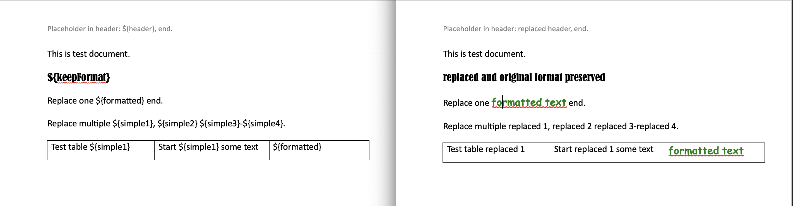

# docx-placeholder-replacer-4j
Replaces placeholders in docx document. Based on "apache poi" library.


## add to project:

Maven:
```xml
<dependency>
    <groupId>io.github.ilyakastsenevich</groupId>
    <artifactId>docx-placeholder-replacer-4j</artifactId>
    <version>1.0.0</version>
</dependency>
```

Gradle:
```groovy
implementation 'io.github.ilyakastsenevich:docx-placeholder-replacer-4j:1.0.0'
```

## code example:
```java
        //your docx template byte[]
        byte[] docxDocument = this.getClass().getClassLoader().getResourceAsStream("test_placeholders.docx").readAllBytes();

        //create new input object
        ReplacePlaceholdersInput input = new ReplacePlaceholdersInput();

        //add docx document
        input.setDocxDocument(docxDocument);

        //add simple text value replacement
        input.add("${header}", "replaced header");
        input.add("${footer}", "replaced footer");
        input.add("${simple1}", "replaced 1");
        input.add("${simple2}", "replaced 2");
        input.add("${simple3}", "replaced 3");
        input.add("${simple4}", "replaced 4");
        input.add("${keepFormat}", "replaced and original format preserved");

        //add text with formatting
        //create format object, every setting is optional
        TextValueFormat format = TextValueFormat.builder()
                .bold(true)
                .colorHex("008000") //green
                .fontFamily("Comic Sans MS")
                .fontSize(15)
                .underlinePattern("WAVY_DOUBLE")
                .underlineColorHex("FF0000") //red
                .build();

        TextValue textValue = new TextValue("formatted text", format);
        input.add("${formatted}", textValue);

        //get replacer instance
        DocxPlaceholderReplacer replacer = DocxPlaceholderReplacer.getInstance();
        //call service's replace method and pass input object
        byte[] resultDocx = replacer.replacePlaceholders(input);
```
## template -> result:
